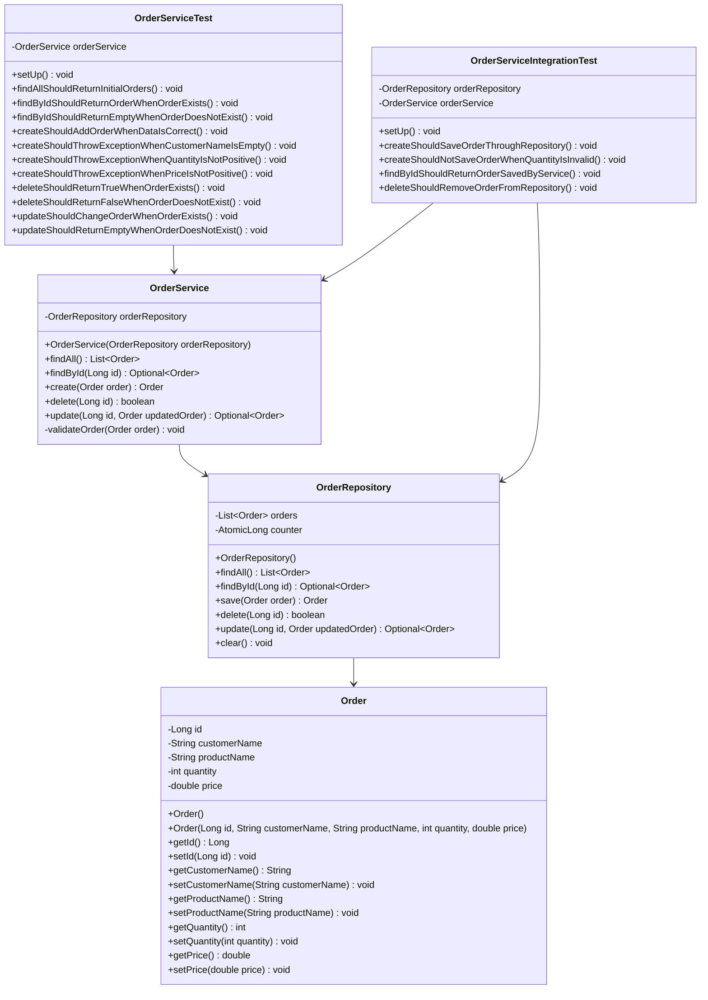

# Лабораторная работа №8

## Тема

Unit- и интеграционное тестирование сервиса заказов в приложении «Магазин зоотоваров».

## Цель работы

Цель работы — настроить проект для автоматизированного тестирования, подключить JaCoCo для формирования отчёта о покрытии кода, написать unit- и интеграционные тесты для сервиса создания заказа.

## Краткое описание проекта

В рамках лабораторной работы использовался проект веб-приложения «Магазин зоотоваров». Основная проверяемая часть приложения — работа с заказами.

В проекте используется модель `Order`, сервисный слой `OrderService` и слой хранения данных `OrderRepository`. Сервис отвечает за выполнение операций над заказами: получение списка заказов, поиск по идентификатору, создание, изменение и удаление.

Для корректной проверки логики создания заказа в сервис была добавлена валидация данных. При создании заказа проверяются имя клиента, название товара, количество и цена. Если данные некорректны, сервис выбрасывает исключение `IllegalArgumentException`.

## Выполненные действия

В ходе выполнения лабораторной работы были выполнены следующие действия:

1. Проект был настроен для запуска unit-тестов.
2. В Gradle были добавлены зависимости для JUnit Jupiter.
3. Был подключён JaCoCo для формирования HTML-отчёта о покрытии кода.
4. Был добавлен класс `OrderRepository`, отвечающий за хранение заказов.
5. Класс `OrderService` был изменён так, чтобы работа с заказами выполнялась через репозиторий.
6. Были написаны unit-тесты для проверки методов сервиса.
7. Были написаны интеграционные тесты для проверки взаимодействия сервиса и репозитория.
8. Был выполнен запуск тестов и сформирован отчёт JaCoCo.

## Настройка Gradle

Для выполнения тестов и формирования отчёта покрытия в проект были добавлены зависимости JUnit Jupiter и JaCoCo.

Фрагмент настройки Gradle:

```groovy
plugins {
    id 'java'
    id 'jacoco'
}

dependencies {
    testImplementation 'org.junit.jupiter:junit-jupiter:5.10.2'
    testRuntimeOnly 'org.junit.platform:junit-platform-launcher'
}

test {
    useJUnitPlatform()
    finalizedBy jacocoTestReport
}

jacoco {
    toolVersion = '0.8.11'
}

jacocoTestReport {
    dependsOn test

    reports {
        xml.required = true
        csv.required = false
        html.required = true
    }
}
```

## Описание реализованных классов

### Класс `Order`

Класс `Order` описывает заказ в магазине зоотоваров. В нём хранятся данные о заказе: идентификатор, имя клиента, название товара, количество и цена.

Основные поля:

```java
private Long id;
private String customerName;
private String productName;
private int quantity;
private double price;
```

### Класс `OrderRepository`

Класс `OrderRepository` отвечает за хранение заказов. Для лабораторной работы используется коллекция `ArrayList`, имитирующая простое хранилище данных.

В репозитории реализованы методы:

```java
findAll()
findById(Long id)
save(Order order)
delete(Long id)
update(Long id, Order updatedOrder)
clear()
```

Метод `clear()` используется в интеграционных тестах, чтобы каждый тест начинался с пустого хранилища.

### Класс `OrderService`

Класс `OrderService` содержит основную бизнес-логику работы с заказами. Он обращается к `OrderRepository`, выполняет проверку данных и передаёт корректные заказы на сохранение.

В сервисе реализованы методы:

```java
findAll()
findById(Long id)
create(Order order)
delete(Long id)
update(Long id, Order updatedOrder)
```

Перед созданием и изменением заказа выполняется проверка данных. Если заказ содержит пустое имя клиента, пустое название товара, отрицательную цену или количество меньше единицы, сервис выбрасывает исключение.

## Unit-тестирование

Unit-тесты были написаны для класса `OrderService`.

В тестах проверялись следующие сценарии:

* получение начального списка заказов;
* поиск существующего заказа по идентификатору;
* поиск несуществующего заказа;
* успешное создание заказа;
* ошибка при создании заказа с пустым именем клиента;
* ошибка при создании заказа с некорректным количеством;
* ошибка при создании заказа с некорректной ценой;
* успешное удаление заказа;
* попытка удаления несуществующего заказа;
* успешное изменение заказа;
* попытка изменения несуществующего заказа.

Пример unit-теста успешного создания заказа:

```java
@Test
void createShouldAddOrderWhenDataIsCorrect() {
    Order order = new Order(null, "Petr Ivanov", "Parrot food", 3, 210.0);

    Order createdOrder = orderService.create(order);

    assertNotNull(createdOrder.getId());
    assertEquals("Petr Ivanov", createdOrder.getCustomerName());
    assertEquals("Parrot food", createdOrder.getProductName());
    assertEquals(3, createdOrder.getQuantity());
    assertEquals(210.0, createdOrder.getPrice());
}
```

Пример unit-теста ошибочного сценария:

```java
@Test
void createShouldThrowExceptionWhenQuantityIsNotPositive() {
    Order order = new Order(null, "Ivan Petrov", "Cat food", 0, 450.0);

    IllegalArgumentException exception = assertThrows(
            IllegalArgumentException.class,
            () -> orderService.create(order)
    );

    assertEquals("Quantity must be positive", exception.getMessage());
}
```

## Интеграционное тестирование

Интеграционные тесты были написаны для проверки совместной работы `OrderService` и `OrderRepository`.

В отличие от unit-тестов, здесь проверяется не отдельный метод в изоляции, а взаимодействие двух слоёв приложения. Сервис принимает заказ, выполняет проверку данных и передаёт объект в репозиторий. После этого тест проверяет, действительно ли данные сохранились в хранилище.

Были проверены следующие сценарии:

* успешное сохранение заказа через сервис в репозиторий;
* отказ от сохранения заказа при некорректном количестве;
* поиск заказа, сохранённого через сервис;
* удаление заказа из репозитория через сервис.

Пример интеграционного теста:

```java
@Test
void createShouldSaveOrderThroughRepository() {
    Order order = new Order(null, "Maria Volkova", "Fish food", 2, 180.0);

    Order createdOrder = orderService.create(order);

    assertNotNull(createdOrder.getId());
    assertEquals(1, orderRepository.findAll().size());
    assertEquals("Maria Volkova", orderRepository.findAll().get(0).getCustomerName());
    assertEquals("Fish food", orderRepository.findAll().get(0).getProductName());
}
```

## Запуск тестов

Для запуска всех тестов использовалась команда:

```bash
./gradlew clean test
```

В Windows PowerShell команда выполнялась так:

```powershell
.\gradlew clean test
```

После запуска тестов сборка завершилась успешно:

```text
BUILD SUCCESSFUL
```

## Формирование отчёта JaCoCo

Для формирования отчёта покрытия кода тестами использовалась команда:

```powershell
.\gradlew jacocoTestReport
```

После выполнения команды HTML-отчёт был сформирован по пути:

```text
build/reports/jacoco/test/html/index.html
```

Отчёт содержит информацию о покрытии классов, методов и строк кода тестами.

## UML-диаграмма классов



## Результаты тестирования

В результате выполнения лабораторной работы были проверены успешные и ошибочные сценарии работы сервиса заказов.

Unit-тесты подтвердили корректность бизнес-логики `OrderService`: сервис создаёт заказ при корректных данных и отклоняет некорректные значения.

Интеграционные тесты подтвердили корректную работу связки `OrderService` и `OrderRepository`: заказ сохраняется в репозитории через сервис, находится по идентификатору и удаляется из хранилища.

JaCoCo сформировал HTML-отчёт о покрытии кода тестами. Отчёт расположен в директории:

```text
build/reports/jacoco/test/html/index.html
```

## Вывод

В ходе лабораторной работы проект был подготовлен к автоматизированному тестированию. Были написаны unit-тесты для проверки логики сервиса заказов и интеграционные тесты для проверки взаимодействия сервиса с репозиторием.

Подключение JaCoCo дало возможность сформировать отчёт о покрытии кода тестами. Полученные результаты подтверждают, что сервис заказов корректно обрабатывает как успешные, так и ошибочные сценарии создания и обработки заказов.
